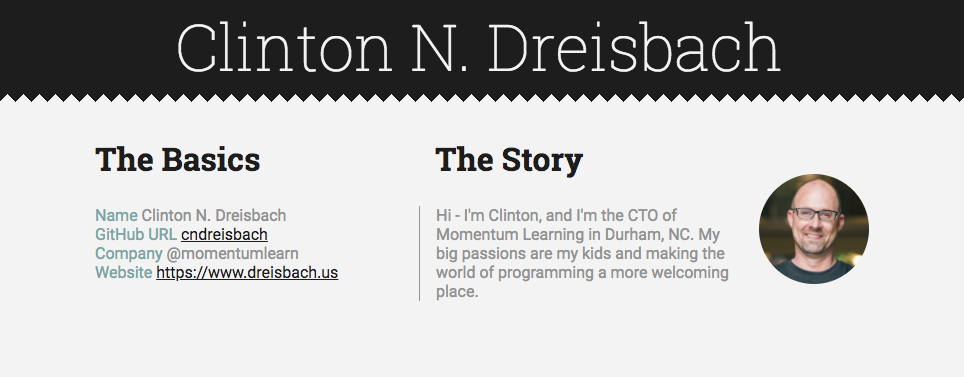

# GitHub Bio Site

## Directions

In today's project, you'll be asked to not only write code to make live Ajax requests, but also write some HTML and CSS to bring a mockup to life.

- Start with the mockup below, and using the GitHub API, pull in the info to build yourself a virtual business card.
- Everything _but_ the headers ("The Basics", "The Story") and the bio will be pulled in via GitHub's API. If it's not there on your GitHub profile, then add it.
- Make sure to pull your avatar in with GitHub and make it a circle.

## Hints

Since there are no starter files provided, you'll need to create your own HTML, CSS, and JavaScript files and link them together properly. Before you start writing any JavaScript, we suggest you spend a few moments reading through the GitHub API docs listed below to get familiar with how you can obtain the data.

Once you have a decent grasp on that, start setting up your Ajax calls and setting up your callback functions to work with the data you retrieve. Insomnia will be helpful to do this as you get started.

## Bonus steps

1. Show your repositories, organizations, and any other interesting data you can request from GitHub that you'd like to add.
2. Read up on the [hCard microformat](http://microformats.org/wiki/h-card) and make sure your page conforms to the hCard standard.

## Resources

- [Full Screen Mockup](github-portfolio.png)
- [GitHub User API](https://api.github.com/users/username) - change `username` in this url to your own username
- [GitHub API Docs](https://docs.github.com/en/rest)
- [Sawtooth banners with CSS](https://medium.com/coding-design/saw-tooth-banners-with-css-95c31e91c196)
- [Getting Started with Insomnia](https://support.insomnia.rest/article/11-getting-started) -- Download the Core app, not the Designer app.
